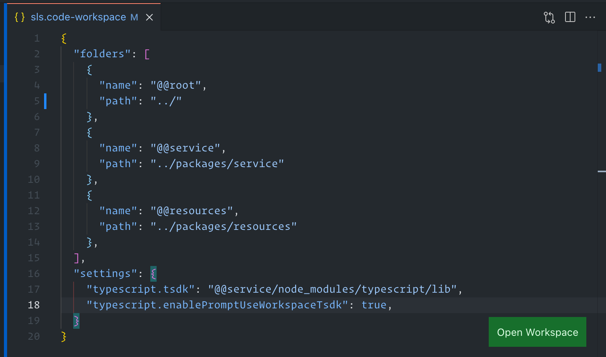
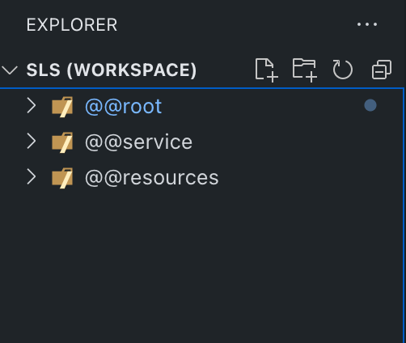

# serverless-webpack-typescript-starte

An opinionated monorepo setup template for a serverless framework application that uses webpack & typescript to write the application.

## Directory Structure

- .vscode
  - _sls.code-workspace_
- packages
  - resources
  - service

To open the project in VSCode go to the root of the respository and open `.vscode/sls.code-workspace`.
You will see a button at the bottom that says _Open Workspace_.

When you click on the button you will see 3 root workspaces in the left sidebar. Each workspace acts like an isolated project with its
own settings & preferences.

- **@@root** - _Root of the repository. Not much here._
- **@@service** - _This contains the serverless framework application code._
- **@@resources** - _This contains the external resources required for your serverless application_

You can create the external resources using terraform, CDK, CloudFormation, etc.

> External resources are resources that needs to have their own lifecycle that is different from the lifecycle of the serverless application. For example you might want to create your networking components separate from your application code because the networking resources will be shared across many applications.
